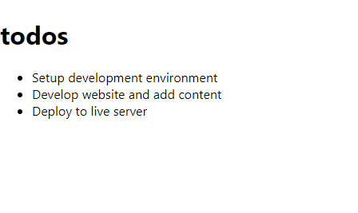

# To Do List

> A demo app to learn React



## Built With

- React
- HTML
- CSS
- JavaScript

## Getting Started

To get a local copy up and running follow these simple example steps.

### Prerequisites

A Web Browser (preferably Google Chrome)

### Setup

- Clone the GitHub Repository
- Go to the Project Directory
- Run ```npm install```

### Usage

In the project directory, you can run:

```npm start```

Runs the app in the development mode.<br>
Open http://localhost:3000 to view it in your browser.

## Authors

👤 **Author 1**

- GitHub: [Awais Amjed](https://github.com/awais-amjed)
- Website: [Coding Fries](https://codingfries.com)
- LinkedIn: [LinkedIn](https://www.linkedin.com/in/awais-amjed)

## 🤝 Contributing

Contributions, issues, and feature requests are welcome!

Feel free to check the [issues page](../../issues/).

## Show your support

Give a ⭐️ if you like this project!

## Acknowledgments

- Microverse

## 📝 License

This project is [MIT](./LICENSE) licensed.
